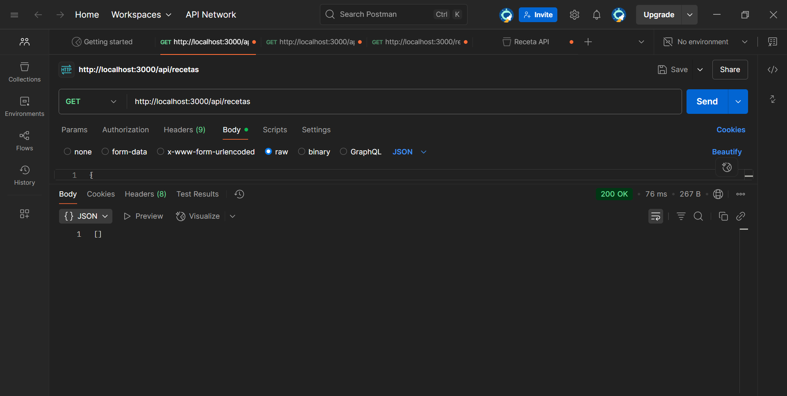

# Semana7practica3 - API de Recetas

Este proyecto es una API REST para la gestión de recetas, desarrollada con **Node.js**, **Express**, **TypeScript** y **TypeORM** usando **PostgreSQL** como base de datos.

## Características

- CRUD de recetas
- Migraciones con TypeORM
- Uso de variables de entorno
- Arquitectura limpia (controllers, services, entities)

## Requisitos

- Node.js >= 14
- PostgreSQL
- npm

## Instalación

1. Clona el repositorio:
   ```sh
   git clone https://github.com/melanieperez26/practica.git
   cd Semana7practica3
   ```

2. Instala las dependencias:
   ```sh
   npm install
   ```

3. Configura las variables de entorno en un archivo `.env` en la raíz del proyecto:
   ```
   DB_HOST=localhost
   DB_PORT=5432
   DB_USER=postgres
   DB_PASSWORD=tu_password
   DB_NAME=recetas_db
   ```

4. Ejecuta las migraciones:
   ```sh
   npx typeorm-ts-node-commonjs migration:run -d src/infrastructure/data/typeorm/data-source.ts
   ```

5. Inicia el servidor:
   ```sh
   npm run dev
   ```

## Endpoints principales

- `GET /recetas` - Lista todas las recetas
- `POST /recetas` - Crea una nueva receta  
  **Body ejemplo:**
  ```json
  {
    "nombre": "Pasta Carbonara",
    "tiempo": 20,
    "ingredientes": ["pasta", "huevo", "bacon"]
  }
  ```

## Notas

- Asegúrate de que la base de datos y las migraciones estén correctamente configuradas antes de iniciar el servidor.
- Si tienes problemas con arrays en PostgreSQL, revisa que el campo `ingredientes` siempre sea un array en el backend.

## Scripts útiles

- `npm run dev` - Ejecuta el servidor en modo desarrollo con ts-node.
- `npx typeorm-ts-node-commonjs migration:run -d src/infrastructure/data/typeorm/data-source.ts` - Ejecuta las migraciones.

---
**Evidencia en Postman utilizando metodo GET:** 


**Autor:**  
Melanie Denisse Perez Posligua